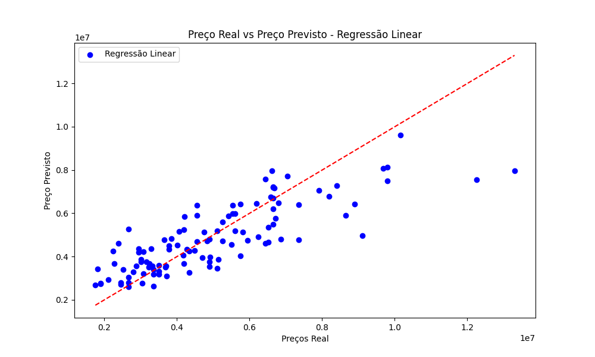

# 🏠 Previsão de Preço de Imóveis com Machine Learning

Este projeto tem como objetivo construir um modelo de *Machine Learning para prever o preço de imóveis* com base em características estruturais da casa, como área, número de quartos, banheiros, localização e comodidades.

A análise segue um pipeline completo de *Data Science*, passando por exploração de dados, engenharia de atributos, modelagem e previsão de novos imóveis.

---

# 🎯 Problema de Negócio

Empresas do setor imobiliário precisam estimar o valor de propriedades de forma rápida e consistente para:

- Definir preços de venda
- Avaliar imóveis
- Apoiar decisões de investimento
- Automatizar avaliações imobiliárias

Neste projeto foi desenvolvido um modelo capaz de *estimar o preço de novos imóveis com base em suas características*.

---

# 🛠 Tecnologias Utilizadas

- Python
- Pandas
- NumPy
- Matplotlib
- Seaborn
- Scikit-Learn
- Jupyter Notebook

---

# 📊 Análise Exploratória de Dados

Durante a etapa exploratória foram analisadas as principais variáveis que influenciam o preço dos imóveis.

Principais análises realizadas:

- Distribuição dos preços
- Correlação entre variáveis
- Relação entre área e preço
- Impacto de características estruturais da casa

---

# 📈 Modelagem

Foram testados dois modelos de regressão:

- *Regressão Linear*
- *Random Forest Regressor*

As métricas utilizadas para avaliação foram:

- MAE (Mean Absolute Error)
- MSE (Mean Squared Error)
- R² Score

### Resultados

| Modelo | MAE | MSE | R² |
|------|------|------|------|
| Regressão Linear | ~970.000 | ~1.75e12 | *0.65* |
| Random Forest | ~1.02e6 | ~1.96e12 | 0.61 |

O modelo de *Regressão Linear apresentou melhor desempenho* neste conjunto de dados.

---

# 📉 Comparação entre Valores Reais e Preditos

O gráfico abaixo mostra a relação entre os preços reais e os preços previstos pelo modelo.

Quanto mais próximos da linha diagonal, melhor o desempenho do modelo.

---

# 🔮 Previsão de Novos Imóveis

Após o treinamento, o modelo foi salvo e utilizado para realizar previsões em novos dados.

Exemplo de variáveis utilizadas para previsão:

- Área do imóvel
- Número de quartos
- Número de banheiros
- Número de andares
- Vagas de garagem
- Presença de porão
- Ar condicionado
- Aquecimento
- Localização preferencial
- Status de mobília

O resultado das previsões foi salvo em:
data/predict/previsoes_imoveis.csv

---

# 📂 Estrutura do Projeto

previsao-preco-imoveis

data/
raw/
processed/
predict/

imagens/

modelo/
modelo_regressao_linear.pkl

notebooks/
EDA_preco_imoveis.ipynb
Feature_Engineering.ipynb
Modelagem_Regressao.ipynb
Previsao_Novos_Imoveis.ipynb

requirements.txt
README.md

---

# 📌 Conclusão

O modelo desenvolvido foi capaz de explicar aproximadamente *65% da variação dos preços dos imóveis*, mostrando que características estruturais da propriedade possuem forte relação com seu valor de mercado.

Esse tipo de modelo pode ser aplicado para:

- sistemas de avaliação imobiliária
- apoio à precificação
- análise de investimentos no setor imobiliário

---

# 👨‍💻 Autor

*Murillo Bernardes*
